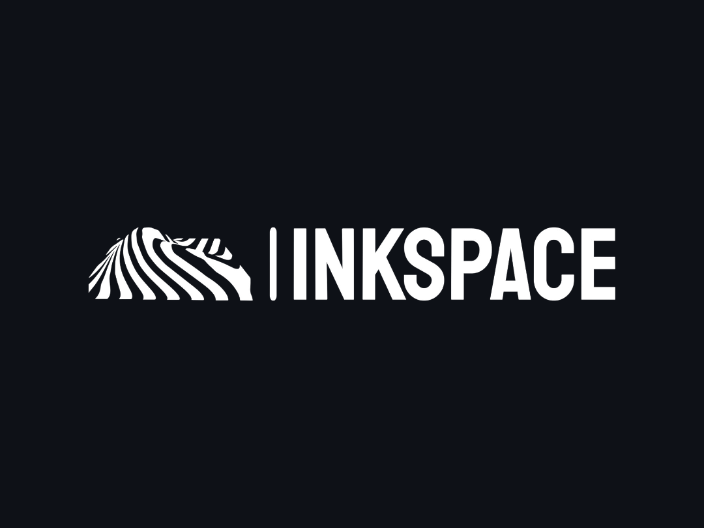

<a name="readme-top"></a>


<!-- PROJECT LOGO -->
<div align="center">
  <a href="https://github.com/andriinero/inkspace">
    
  </a>

  <h3 align="center">InkSpace</h3>

  <p align="center">
    Fullstack React Web Application written in TypeScript
    <br />
    <a href="https://inkspace-alpha.vercel.app/">View Demo</a>
    ·
    <a href="https://github.com/andriinero/inkspace/issues/new">Report Bug</a>
    ·
    <a href="https://github.com/andriinero/inkspace/issues/new">Suggestion</a>
  </p>
</div>


<!-- TABLE OF CONTENTS -->
<details>
  <summary>Table of Contents</summary>
  <ol>
    <li>
      <a href="#about-the-project">About The Project</a>
      <ul>
        <li><a href="#built-with">Built With</a></li>
      </ul>
    </li>
    <li>
      <a href="#getting-started">Getting Started</a>
      <ul>
        <li><a href="#prerequisites">Prerequisites</a></li>
        <li><a href="#installation">Installation</a></li>
      </ul>
    </li>
    <li><a href="#contributing">Contributing</a></li>
  </ol>
</details>


### Built With
- [![Neovim][Neovim]][Neovim-url]
- [![JavaScript][JavaScript]][JavaScript-url]
- [![TypeScript][TypeScript]][TypeScript-url]
- [![React][React]][React-url]
- [![Redux][Redux]][Redux-url]
- [![Styled-Components][StyledComponents]][StyledComponents-url]
- [![Node.js][NodeJS]][NodeJS-url]
- [![Express.js][Express]][Express-url]
- [![MongoDB][MongoDB]][MongoDB-url]
- [![JWT][JWT]][JWT-url]
- [![Vite][Vite]][Vite-url]

<p align="right">(<a href="#readme-top">back to top</a>)</p>


<!-- GETTING STARTED -->
## Getting Started

To get a local copy up and running follow these simple example steps.

### Prerequisites
To run this app, you'll need NodeJS on your system.

If you don't have NodeJS installed, no worries! Just visit the amazing new [NodeJS installation guide](https://nodejs.org/en/download/package-manager) and you'll find all the info you need to get started.

### Installation
1. Go to [inkspace_backend](https://github.com/andriinero/inkspace_backend) and follow installation steps there first
2. Once you're done with the fist step clone the repo
   ```sh
   git clone https://github.com/andriinero/inkspace.git
   ```
3. Go to the cloned repo and install NPM packages
   ```sh
   npm install
   ```

4. After installing packages you can start your local server
   ```sh
   npm run dev
   ```
*NOTE: If the new tab didn't open in your browser, visit http://localhost:5173 to see the app*

<p align="right">(<a href="#readme-top">back to top</a>)</p>


<!-- CONTRIBUTING -->
## Contributing

Contributions are what make the open source community such an amazing place to learn, inspire, and create. Any contributions you make are **greatly appreciated**.

If you have a suggestion that would make this better, please fork the repo and create a pull request. You can also simply open an issue with the tag "enhancement".
Don't forget to give the project a star! Thanks again!

1. Fork the Project
2. Create your Feature Branch (`git checkout -b feature/AmazingFeature`)
3. Commit your Changes (`git commit -m 'Add some AmazingFeature'`)
4. Push to the Branch (`git push origin feature/AmazingFeature`)
5. Open a Pull Request

<p align="right">(<a href="#readme-top">back to top</a>)</p>


<!-- MARKDOWN LINKS & IMAGES -->
[Neovim]: https://img.shields.io/badge/NeoVim-%2357A143.svg?&style=for-the-badge&logo=neovim&logoColor=white
[Neovim-url]: https://neovim.io/
[TypeScript]: https://img.shields.io/badge/typescript-%23007ACC.svg?style=for-the-badge&logo=typescript&logoColor=white
[TypeScript-url]: https://www.typescriptlang.org/
[JavaScript]: https://img.shields.io/badge/javascript-%23323330.svg?style=for-the-badge&logo=javascript&logoColor=%23F7DF1E
[JavaScript-url]: https://developer.mozilla.org/en-US/docs/Web/JavaScript
[React]: https://img.shields.io/badge/React-20232A?style=for-the-badge&logo=react&logoColor=61DAFB
[React-url]: https://reactjs.org/
[Redux]: https://img.shields.io/badge/redux-%23593d88.svg?style=for-the-badge&logo=redux&logoColor=white
[Redux-url]: https://redux-toolkit.js.org/
[StyledComponents]: https://img.shields.io/badge/styled--components-DB7093?style=for-the-badge&logo=styled-components&logoColor=white
[StyledComponents-url]: https://styled-components.com/
[JWT]: https://img.shields.io/badge/JWT-black?style=for-the-badge&logo=JSON%20web%20tokens
[JWT-url]: https://jwt.io/introduction
[NodeJS]: https://img.shields.io/badge/node.js-6DA55F?style=for-the-badge&logo=node.js&logoColor=white
[NodeJS-url]: https://nodejs.org/
[Express]: https://img.shields.io/badge/express.js-%23404d59.svg?style=for-the-badge&logo=express&logoColor=%2361DAFB
[Express-url]: https://expressjs.com/
[MongoDB]: https://img.shields.io/badge/MongoDB-%234ea94b.svg?style=for-the-badge&logo=mongodb&logoColor=white
[MongoDB-url]: https://www.mongodb.com/
[Vite]: https://img.shields.io/badge/vite-%23646CFF.svg?style=for-the-badge&logo=vite&logoColor=white
[Vite-url]: https://vitejs.dev/
